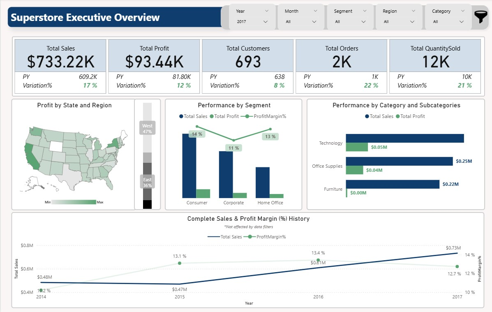
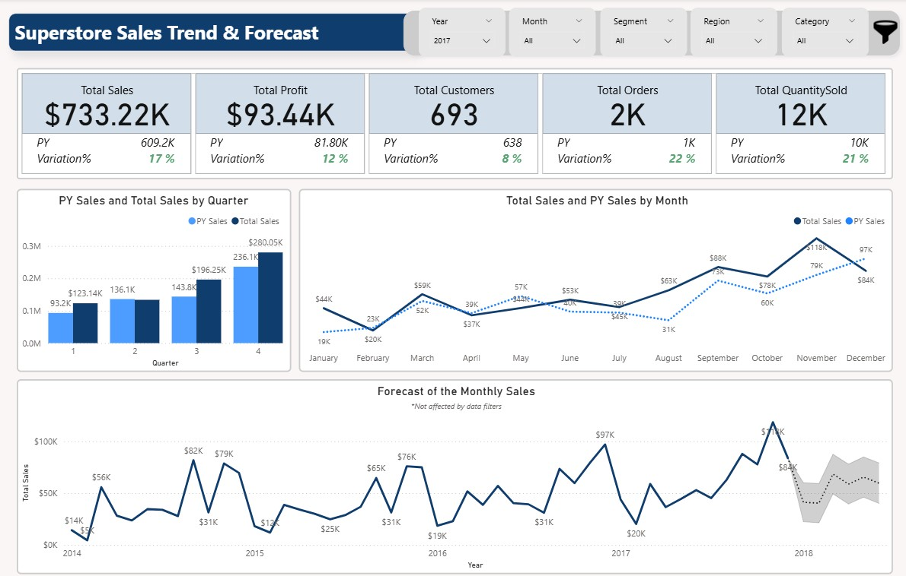
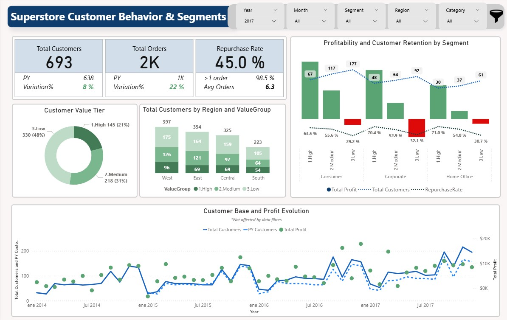
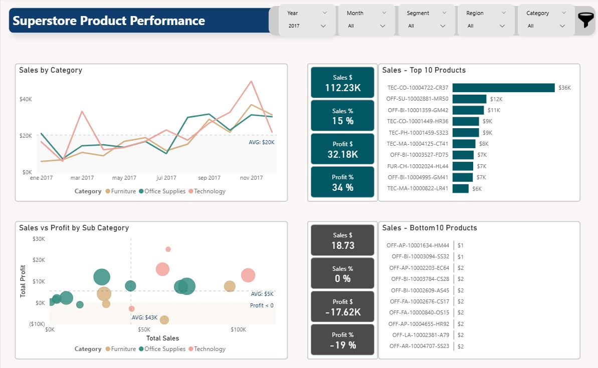
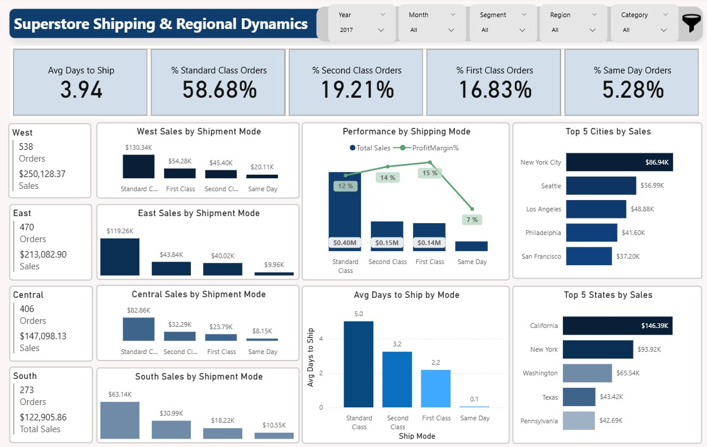
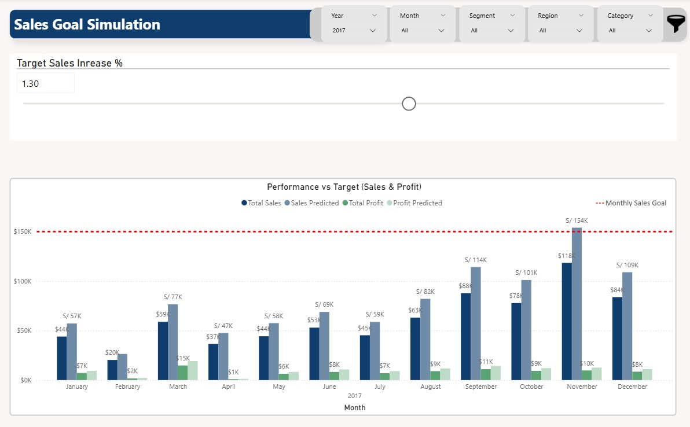

# Sales Forecasting & Analysis using Power BI: Superstore

## Project Overview

This project presents a comprehensive Power BI dashboard analyzing the sales and profit performance of the Superstore dataset from 2014 to 2017. The dashboard provides interactive insights into regional performance, product and customer trends, and shipping dynamics. A key feature is the integration of a forecasting model to predict future sales and a "what-if" parameter to simulate sales goal scenarios, providing a powerful tool for strategic business planning.

---

## Dashboard Preview

*(**PBI file** Find the power bi file on the path repository:..)*

---

## Key Features & Analysis Areas

This dashboard is composed of multiple analytical views:

1. **Executive Overview:** A high-level summary of critical KPIs (Total Sales, Profit, Customers, Orders) with year-over-year performance comparisons. Sales breakdown by region, category, and customer segment.

  

2. **Sales Trend Forecasting:** Time series analysis of historical sales, including a 6-month forecast with confidence intervals to identify seasonal patterns and predict future performance.

  

3. **Customer & Segment Analysis:** Deep dive into customer behavior, including a custom repurchase rate calculation and a value-tier segmentation (High, Medium, Low Value) based on profit contribution. Customer distribution by geography and business segment.

  

4. **Product Analysis:** Quadrant analysis of product subcategories based on sales vs. profit, identifying top performers and underachievers. Category trends over time.

  

5. **Shipping & Regional Dynamics:** Analysis of shipping modes, delivery times, and regional sales and profit distribution.

  

6. **What-If Scenario Simulation:** An interactive sales goal simulation using a "what-if" parameter to help the sales team quantify the growth needed to meet targets.

  

---

## Data Model & Methodology

### 1. Data Cleaning and Transformation (ETL)
The process began with a single flat file. In Power Query, the following steps were performed:
- **Removed redundant columns** (`Row ID`, `Country`) that provided no analytical value.
- **Cleansed data formats**, using `Locale` to correctly parse dates and replacing characters to standardize numerical columns (`Sales`, `Profit`).

### 2. Data Modeling
To optimize performance and create an efficient data structure, the single table was normalized into a **Snowflake Schema**.
- **13 distinct dimension tables** were created for `Orders`, `Customers`, `Products`, `Locations`, etc.
- **A central fact table** (`fct_Superstore`) was established containing KPIs like Sales and Profit.
- Added a custom calendar table for time-series filtering and forecasting.
- Relationships were defined to ensure correct filter propagation and accurate KPI calculations.

### 3. DAX Measures
Advanced DAX was used to create complex calculations, including:
- **Customer Value Tiers:** Used `PERCENTILEX.INC` to segment customers into High, Medium, and Low value tiers based on their profit percentile ranking.
- **Custom Repurchase Rate:** Defined a more stringent repurchase threshold (more than 6 orders) to identify true customer loyalty beyond a simple second purchase.

---

## Key Insights & Recommendations

### Insights
- **Seasonal Sales Trend:** Q3 and Q4 consistently show significant sales increases each year, highlighting the importance of end-of-year strategic planning.
- **High-Value Customer Concentration:** The top 20% of customers (High Value) are not only the most profitable but also have strong retention rates (>63%) and are geographically concentrated in the West region.
- **Product Profitability Gap:** The "Furniture" category generates substantial sales but delivers minimal profit, indicating a need to reassess pricing or operational costs.

### Recommendations
- **Validate Forecasts:** Continuously monitor and validate forecast results against actual performance to refine the model's accuracy.
- **Review Underperforming Products:** Assess whether subcategories with negative profits (e.g., Tables, Bookcases) still add strategic value or if their logistics costs should be reallocated to higher-performing products.
- **Refine Repurchase Methodology:** The custom repurchase rate methodology should be continuously reviewed to ensure the threshold remains appropriate as the business grows.
- Collect delivery time-to-destination data to improve shipping analysis.

---

## Acknowledgments
This project was completed as part of the CPSC 510 course at the University of Niagara Falls in collaboration with my talented team members: Rodrigo Alfaro Villafuerte, Natalia Guasca Gómez, and Jorge Mendoza.
